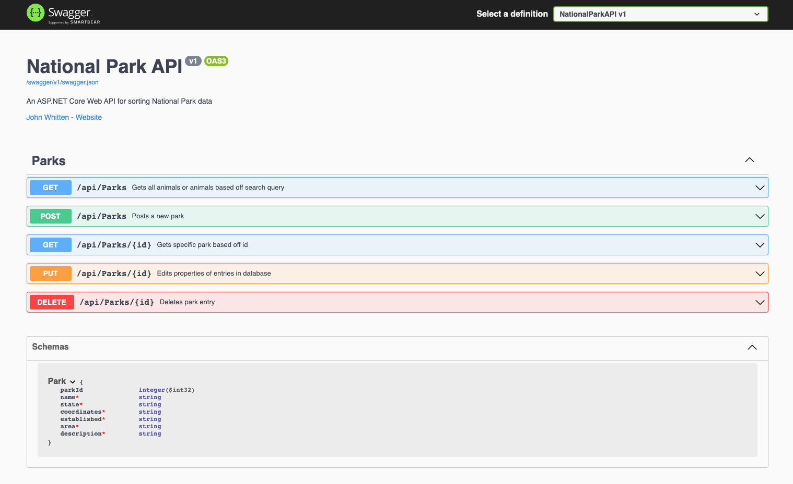

# <p align="center"> 🏔️ **National Parks API** 🏜️ </p>

#### _A queryable C#/ASP.NET Core API using RESTful principles and Swagger to sort and document National Park data._

#### by **John Whitten** ~ April 22, 2022

## Table of Contents

1. [Technologies Used](#technologies)
2. [Description](#description)
3. [Setup/Installation Requirements](#setup)
4. [Known Bugs](#bugs)
5. [License](#license)
6. [Contact Information](#contact)

## Technologies Used <a id="technologies"></a>

- C#
- .NET 5.0
- MySQL
- ASP.NET Core MVC
- Microsoft.AspNetCore.Identity.EntityFrameworkCore 5.0.0
- Microsoft.EntityFrameworkCore 5.0.0
- Microsoft.EntityFrameworkCore.Design 5.0.0
- Microsoft.NET.Sdk.Web
- Microsoft.NET.Test.Sdk 15.0.0
- MSTest.TestAdapter 1.3.2
- MSTest.TestFramework 1.3.2
- Pomelo.EntityFrameworkCore.MySql 5.0.0-alpha.2
- Swashbuckle.AspNetCore 6.2.3

## Description <a id="description"></a>

A C#/.NET API that allows other developers to interact with data about the National Parks in the United States.


## Project Setup/Installation Instructions <a id="setup"></a>

### Install C#, .NET, MySQL Community Server and MySQL Workbench

- Open the terminal on your local machine
- If [C#](https://docs.microsoft.com/en-us/dotnet/csharp/) and [.NET](https://docs.microsoft.com/en-us/dotnet/) are not installed on your local device, follow the instructions here [here](https://www.learnhowtoprogram.com/c-and-net-part-time/getting-started-with-c/installing-c-and-net).
- If [MySQL Community Server](https://dev.mysql.com/downloads/mysql/) and [MySQL Workbench](https://www.mysql.com/products/workbench/) are not installed on your local device, follow the instructions [here](https://www.learnhowtoprogram.com/c-and-net-part-time/getting-started-with-c/installing-and-configuring-mysql).
- If [dotnet-ef](https://docs.microsoft.com/en-us/ef/core/cli/dotnet) is not installed on your local device, install it globally with the terminal command ```dotnet tool install --global dotnet-ef --version 5.0.2```.

### Clone the project

- Open the terminal on your local computer.
- Navigate to the parent directory of your preference.
- Clone this project using `$ git clone https://github.com/johnwhittenstudio/NationalPark.Solution`


### Scaffold and connect the database

- Launch the MySQL server with the command `mysql -uroot -p[YOUR-PASSWORD-HERE]`
- Navigate to the directory: `$ cd NationalPark.Solution`
- Open in Vs code: `$ code .`
- Navigate to the project directory NationalPark: `$ cd NationalPark` and type the following command in the terminal `$ touch appsettings.json`
- In the appsettings.json file enter the following code:

```
{
    "ConnectionStrings": {
        "DefaultConnection": "Server=localhost;Port=3306;database=national_park_api;uid=root;pwd=[YOUR-PASSWORD-HERE];"
    }
}
```
- Recreate project environment and install required dependencies with terminal command `$ dotnet restore`
- Build the program with the command `$ dotnet build`
- Scaffold the database with the command ```$ dotnet ef database update```

### Run the project
- Run the program with the command `$ dotnet run`
- Open the project by navigating your browser to http://localhost:5000/api/Parks or https://localhost:5001/api/Parks.

### Explore the API Endpoints and Schema with Swagger
- Once you've run the program in the console (see above), explore and test the API endpoints and schema with Swagger by navigating to http://localhost:5000/index.html.



## Known Bugs <a id="bugs"></a>

- _None._

## License <a id="license"></a>

[MIT License](https://opensource.org/licenses/MIT) © 2022 _John Whitten_

## Contact <a id="contact"></a>

John Whitten: [johnwhitten.studio@gmail.com](mailto:johnwhitten.studio@gmail.com)